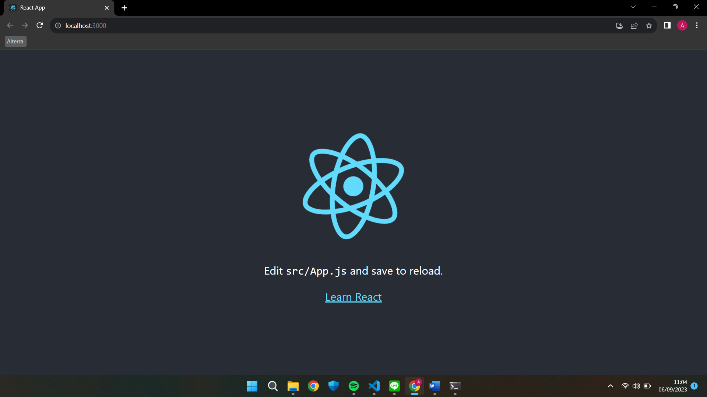
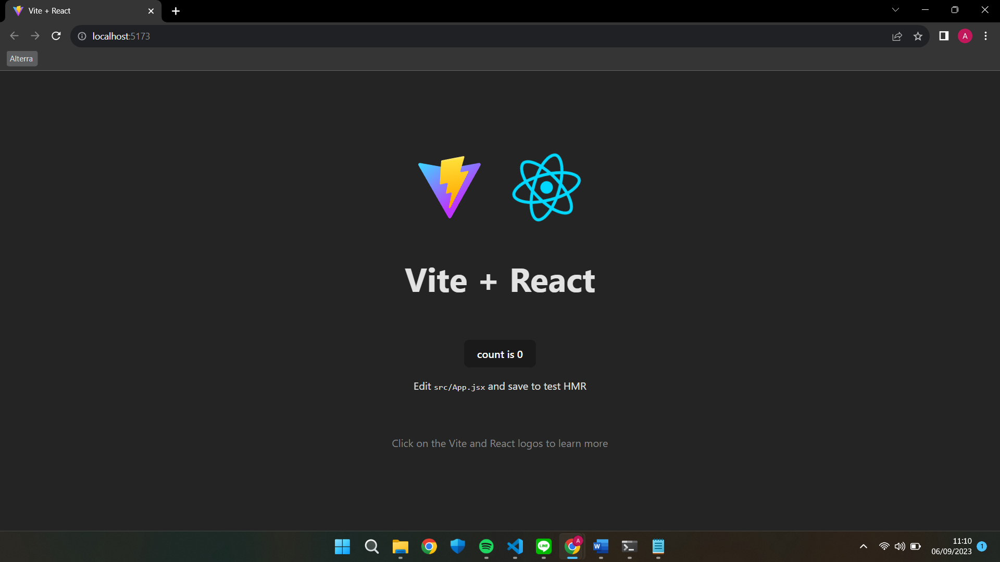

# Introduction React

## 1. Apa itu React
React adalah sebuah library JavaScript yang digunakan untuk membangun interface dalam aplikasi web. React dikembangkan oleh Facebook dan sering digunakan bersama dengan berbagai teknologi dan kerangka kerja lainnya untuk mengembangkan komponen interface yang interaktif dan efisien.
## 2. Kegunaan React
React memiliki banyak kegunaan dalam pengembangan aplikasi, seperti:
* Digunakan secara luas untuk membangun interface UI dalam aplikasi web yang interaktif, reaktif terhadap perubahan data, dan mudah dipelihara
* Sangat cocok untuk membangun Single Page Application, dimana seluruh aplikasi dimuat sekali dan berinteraksi dengan server melalui permintaan AJAX atau API
* Pengembangan komponen UI reusable
* Pengembangan aplikasi berbasis data dan real-time
## 3. Kelebihan menggunakan React
* **Komponen** 
React membagi interface menjadi komponen yang terpisah. Komponen ini digunakan untuk membangun UI lebih besar dan masing-masing komponen dapat memiliki properti yang memungkinkan data untuk dipindahkan di antara komponen.
* **Virtual DOM** 
React menggunakan Virtual DOM untuk meningkatkan efisiensi dalam memperbarui tampilan aplikasi. Dengan menggunakan Virtual DOM, React dapat memperbarui hanya bagian-bagian yang diperlukan dari tampilan tanpa harus merender ulang seluruh halaman.
* **Reaktivitas** 
Ketika data dalam komponen berubah, React secara otomatis memperbarui tampilan sesuai dengan perubahan tersebut. Ini memungkinkan developer untuk membangun UI yang reaktif terhadap perubahan data tanpa harus mengelola pembaruan tampilan secara manual.
* **JSX** 
React menggunakan JSX sebagai sintaksis untuk mendefinisikan struktur tampilan dalam JavaScript, sehingga memudahkan dalam pembuatan komponen UI.
* **Komunitas yang kuat** 
React memiliki komunitas developer yang besar dan aktif, sehingga banyak sumber daya, alat, dan komponen pihak lain yang tersedia untuk membantu dalam development.

### Tugas Prioritas

### Tugas Eksplorasi

